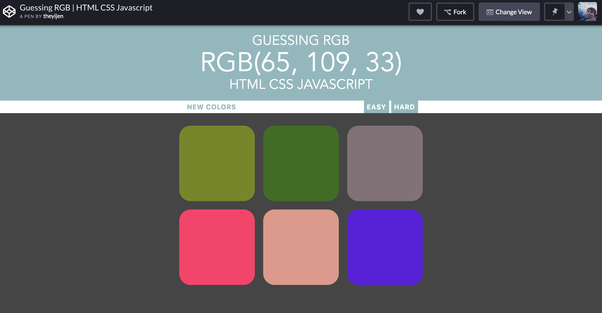

# Color Game
An example javascript project, guessing rgb color.

## Link to the Project
* [codepen](https://codepen.io/theyij/full/RwwbBrg) 

## Task
This is a project as a simple calculator for expacts in Japan to have a basice understanding about tax, pension and insurances.

## Function
This project can now calculate your general tax, pension, etc.

## Tech Stack
* Javascript
* CSS
* DOM
* HTML
